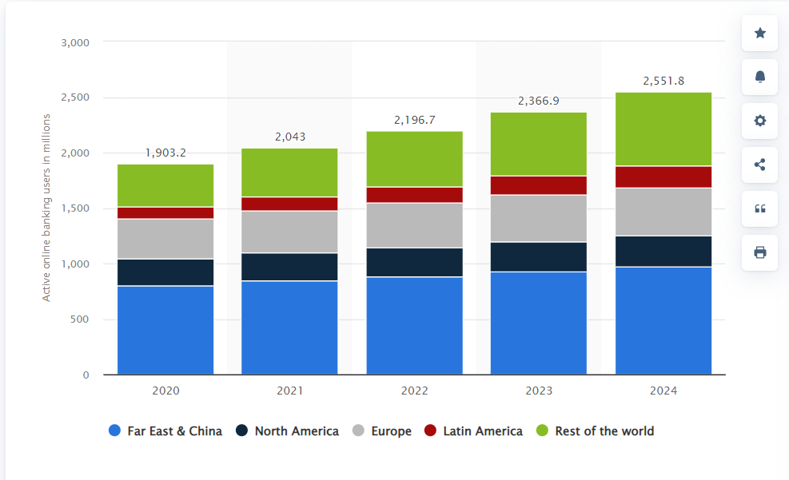

# FinTech Case Study: Fiserv (FISV)

## About Fiserv

Fiserv, Inc. is a global provider of payments and financial technology services and solutions. It is recognized as a leader in this industry, and a Fortune 500 company, with the 128th biggest weighting. It is a member of large passive investment ETFs including S&P 500, Nasdaq 100, and Global X Fintech (FINX). "The types of services Fiserv provides are digital banking solutions, account processing, card issuer processing and network services, payments exchanges and transactions, merchant acquiring and processing, and the Clover cloud-based point-of-sale solution. The industries Fiserv contributes towards include Merchant Acceptance (Acceptance), Financial Technology (Fintech) and Payments and Network (Payments). Fiserv provides financial institutions and other various companies, of all sizes, around the world with the technology solutions they need to run their operations." [About Fiserv](https://investors.fiserv.com/?_ga=2.163258428.1229057823.1654039143-1450948257.1654039143)

### A list of Fiserv's trusted merchants include:

- AT&T Inc. (T)
- Citigroup Inc. (C)
- Fifth Third Bank Corp. (FITB)
- First National Bank Corp. (FNB)
- Liberty Bank

[List of Notable Fiserv Customers](https://www.featuredcustomers.com/vendor/fiserv/customers)

## History of Fiserv

 - 1984: Fiserv was founded through the merger of First Data Processing and Sunshine State Systems. 
 - 1986: Two years after its founding, Fiserv IPO'd on the Nasdaq under the ticker symbol (FISV).
 - 1997: Introuced eBills, enabling consumers to pay, recieve and view bills online.
 - 2007: Fiserv acquires CheckFree Corp. a leading provider in electronic billing, and payments innovator.
 - 2008: Launches mobile banking solution, offering banking access via text, mobile browsing and app.
 - 2013: Fiserv acquires Open Solutions to include DNA.
 - 2019: Fiserv completes a combination with First Data to create one of the world's leading payments and fintech providers giving access to thousands of financial institutions and small businesses.

[History of Fiserv](https://www.fiserv.com/en/about-fiserv.html#2020)

[More on Fiserv's Acquisitions](https://en.wikipedia.org/wiki/Fiserv) (Under Acquistions Header)

## Business Metrics 

### 2021 Full Year Finanical Results

- 16 Billion in Total Revenue
- 1.3 Billion in Net Income
- 5.58 Adjusted EPS
- 3 Billion in FinTech Revenue
- 76 Billion in Total Assets
- 18 Billion in Current Liabilities
- 3.5 Billion in Free Cash Flow

### 2021 Full Year Earnings Highlights

- Total Revenue increased 11% YoY to 15.39 Billion 
- Organic Revenue growth was 11% led by:
    - 19% growth in Acceptance, 4% growth in Fintech, 8% growth in Payments
- GAAP EPS increased 42% for the full year
- Repurchased 2.57 Billion worth of stock

### Outlook for 2022

- Organic Revenue growth between 7% to 9%
- Adjusted EPS growth between 15% to 17%

[Fiserv FY 2021 Financial Results](https://newsroom.fiserv.com/news-releases/news-release-details/fiserv-reports-fourth-quarter-and-full-year-2021-results)

### 2022 Q1 Finanical Results

- GAAP Revenue growth of 10%
- Organic Revenue growth of 11%
- GAAP EPS increased 127%
- Adjusted EPS increased 20%
- Adjusted Operating Margin increased 60 basis points to 32%
- Repurchased 500 Million worth of stock

[Fiserv Q1 2022 Financial Results](https://newsroom.fiserv.com/news-releases/news-release-details/fiserv-reports-first-quarter-2022-results)

## Notable Competitors (All Fortune 500 Companies)

- Mastercard Inc. (MA)
- Visa Inc. (V)
- Paypal Holdings Inc. (PYPL)
- Oracle Corp. (ORCL)
- Block Inc. (SQ)
- Jack Henry & Associates, Inc. (JKHY)
- Global Payments Inc. (GPN)
- FleetCor Technologies Inc. (FLT)
- Fidelity National Information Services Inc. (FIS)
- Intuit Inc. (INTU)

[Fiserv Competitors](https://finbox.com/NASDAQGS:FISV/explorer/indexes)

[More Fiserv Competitors](https://www.barchart.com/stocks/quotes/FISV/competitors?orderBy=weightedAlpha&orderDir=desc)

## Synposis 

### Landmarks

Here is a recap of milestones achieved from the Fintech industry:

- Embracing a customer-centric approach and leveraging AI, data analytics and automation.
- Buy-now-pay-later becomes 2021’s hottest trend amid a push for greater flexibility around payment options.
- The ensuing success of Finance-as-a-Service (FaaS) solutions and booming adoption of embedded banking APIs.
- $6.6bn USD was spent on blockchain solutions in 2021.

*Landmarks taken from* [Netguru](https://www.netguru.com/blog/fintech-trends-2022)

### Trends and Global Tailwinds

1. High Growth Potential

As internet increases in accessbility, the number of users will increase. This can be seen from a forecast done by [Statista](https://www.statista.com/statistics/1228757/online-banking-users-worldwide/) (Seen in figure above). The number of active online banking users worldwide in 2020 reached almost 2 billion for the first time. With an expected 2.5 billion to reach active online banking in 2024. 

2. Shifting Consumer Expectations

Digital companies have historically catered to modern consumers, due to increasing competitiveness, convenience and overall cost. Here's a list of how Fintech companies meet these demands:
- Providing easier digital payments for customers
- Improving access to finance for the underserved
- Identifying bad actors in the digital payment space
- Enhancing transaction approval rates for retailers

*Shifting Consumer Expectations taken from*  [Fintech Magazine](https://fintechmagazine.com/digital-payments/fintech-retail-trends-and-shifting-consumer-expectations)

